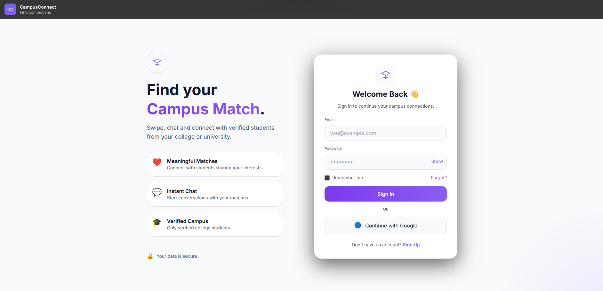
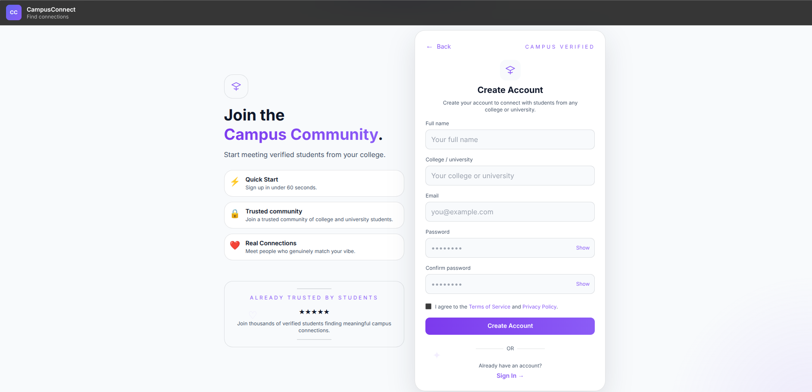
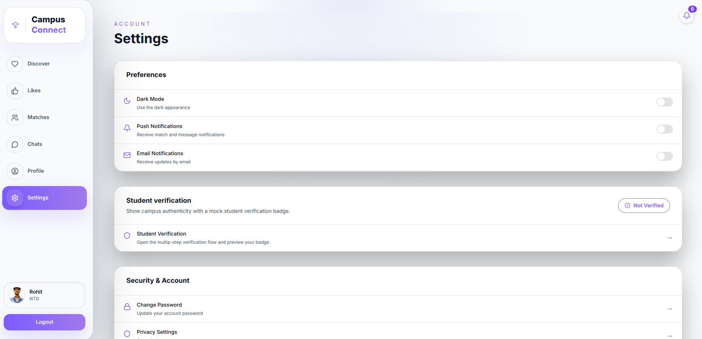
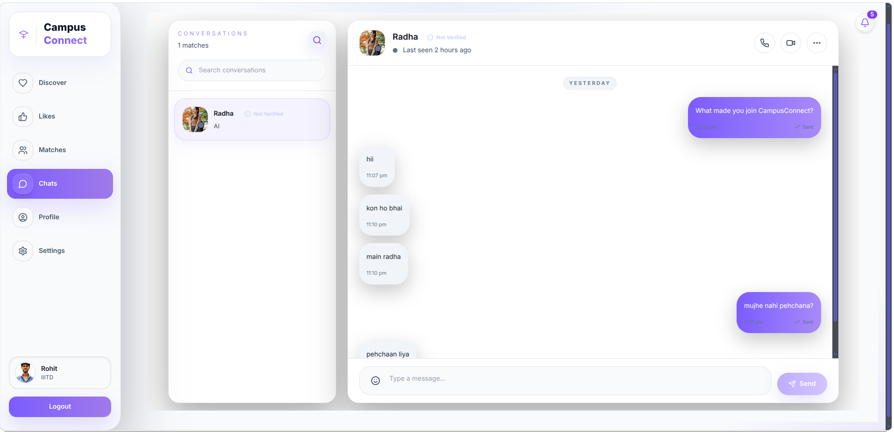
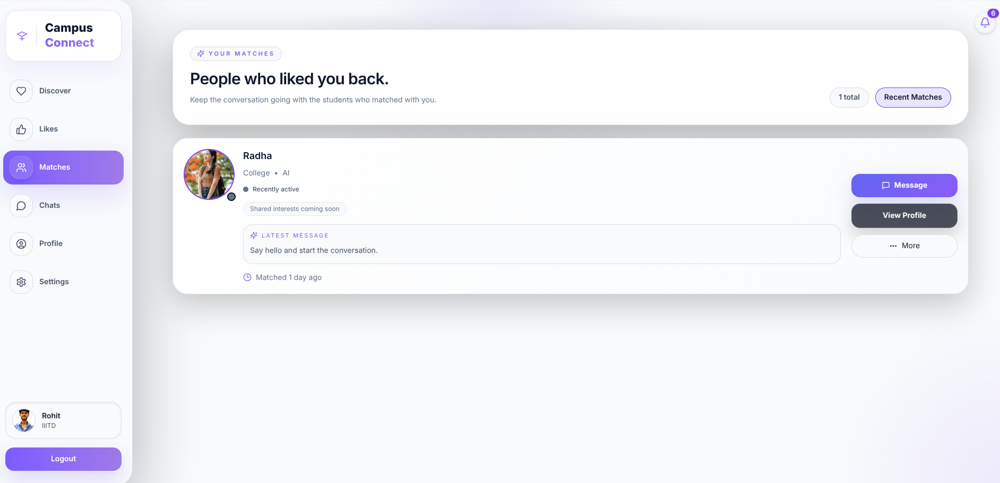

# 🎓 CampusConnect

<div align="center">


*A modern full-stack campus networking platform that helps college students connect, collaborate, discover events, join communities, and build meaningful relationships through an integrated matching system.*

</div>

---

# 📖 Overview

CampusConnect is a **full-stack social networking platform** built specifically for college students.

Instead of juggling multiple apps for events, networking, study groups, clubs, and meeting new people, CampusConnect brings everything together into one secure platform.

The application focuses on providing a verified campus ecosystem where students can:

- 👥 Connect with fellow students
- 🎉 Discover campus events
- 📚 Find study partners
- 💬 Chat in real time
- ❤️ Match with students through an optional dating feature
- 🏛️ Join clubs and communities
- 📢 Share updates through a social feed

---

# ✨ Features

## 🔐 Authentication

- JWT Authentication
- Secure Login & Registration
- Password Encryption
- Role-based Authorization
- Protected Routes

---

## 👤 Student Profiles

- Profile Picture
- Bio
- Department
- Graduation Year
- Interests
- Skills
- Social Links

---

## 📰 Social Feed

- Create Posts
- Like Posts
- Comment
- Delete Own Posts
- Infinite Feed

---

## ❤️ Matching System

- Swipe-based Matching
- Mutual Likes
- Compatibility Matching
- Match History

---

## 💬 Chat

- One-to-One Messaging
- Real-Time Chat
- Online Status
- Read Receipts *(Planned)*

---

## 🎉 Campus Events

- Browse Events
- Register for Events
- Event Details
- Event Recommendations

---

## 🏛️ Communities

- Join Clubs
- Create Communities
- Discussion Boards

---

## 🔔 Notifications

- Friend Requests
- Match Notifications
- Event Updates
- Chat Notifications

---

# 🛠 Tech Stack

## Frontend

- React 19
- Vite
- Tailwind CSS
- Axios
- React Router

## Backend

- Java 17
- Spring Boot
- Spring Security
- Spring Data JPA
- JWT Authentication
- Maven

## Database

- MySQL

## Tools

- Git
- GitHub
- Postman
- IntelliJ IDEA
- VS Code

---

# 📂 Project Structure

```
CampusConnect
│
├── backend
│   ├── controller
│   ├── service
│   ├── repository
│   ├── model
│   ├── dto
│   ├── security
│   ├── config
│   └── resources
│
├── frontend
│   ├── src
│   │   ├── components
│   │   ├── pages
│   │   ├── hooks
│   │   ├── context
│   │   ├── services
│   │   └── assets
│
└── README.md
```

---

# 📸 Screenshots

## Login

<p align="center">

</p>

---

## Registration

<p align="center">

</p>

---

## Settings

<p align="center">

</p>

---

## Chat

<p align="center">

</p>

---

## Matching

<p align="center">

</p>

---

# 🚀 Getting Started

## Clone Repository

```bash
git clone https://github.com/yourusername/CampusConnect.git

cd CampusConnect
```

---

## Backend

```bash
cd backend

mvn clean install

mvn spring-boot:run
```

Backend runs on:

```
http://localhost:8080
```

---

## Frontend

```bash
cd frontend

npm install

npm run dev
```

Frontend runs on:

```
http://localhost:5173
```

---

# ⚙ Environment Variables

Backend

```
SPRING_DATASOURCE_URL=

SPRING_DATASOURCE_USERNAME=

SPRING_DATASOURCE_PASSWORD=

JWT_SECRET=

JWT_EXPIRATION=
```

Frontend

```
VITE_API_URL=http://localhost:8080
```

---

# 📌 Current Development Progress

| Module | Status |
|---------|--------|
| Backend Setup | ✅ |
| Authentication | ✅ |
| JWT Security | ✅ |
| Database Design | ✅ |
| User APIs | ✅ |
| Frontend Setup | ✅ |
| Login Page | ✅ |
| Register Page | ✅ |
| Feed | 🚧 |
| Chat | 🚧 |
| Matching | 🚧 |
| Events | 🚧 |
| Communities | 🚧 |
| Notifications | 🚧 |
| Deployment | ⏳ |

---

# 🗺 Roadmap

- [x] Backend Setup
- [x] React Frontend
- [x] JWT Authentication
- [x] User Registration
- [x] Login
- [ ] Student Profiles
- [ ] Feed
- [ ] Likes & Comments
- [ ] Matching System
- [ ] Chat
- [ ] Event Module
- [ ] Communities
- [ ] Notifications
- [ ] Docker Support
- [ ] Deployment

---

# 📈 Future Enhancements

- AI-powered Match Recommendations
- Video Calling
- Campus Marketplace
- Anonymous Confessions
- Push Notifications
- Event Recommendation Engine
- Dark Mode
- Mobile App

---

# 🤝 Contributing

Contributions, issues, and feature requests are welcome!

Feel free to fork the repository and submit a pull request.

---

# 👨‍💻 Author

**Rohit Sharma**

B.Tech CSE | IIIT Delhi

GitHub:
https://github.com/rohitchell87

---

# 📄 License

This project is licensed under the MIT License.

---

<div align="center">

⭐ If you found this project interesting, consider giving it a star!

</div>
